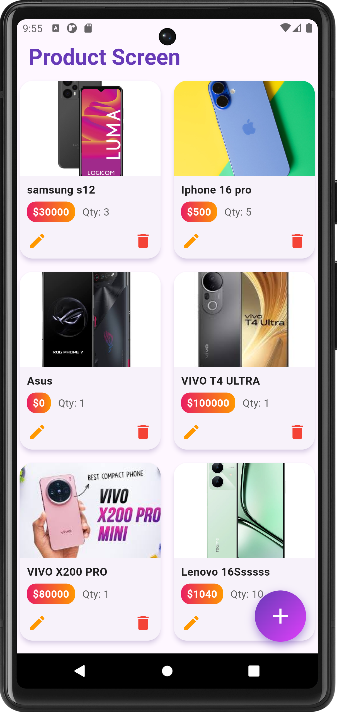
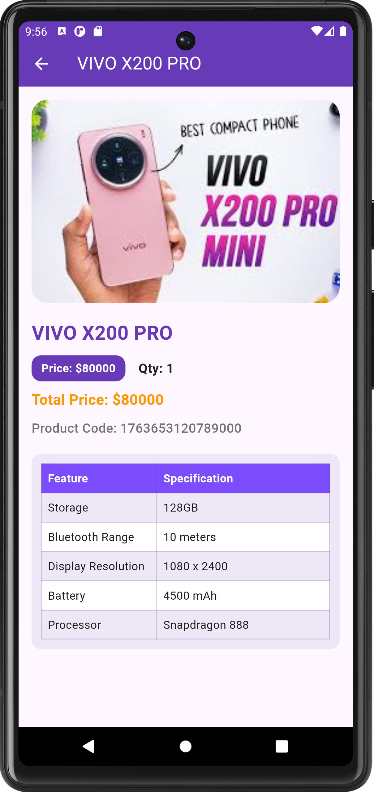
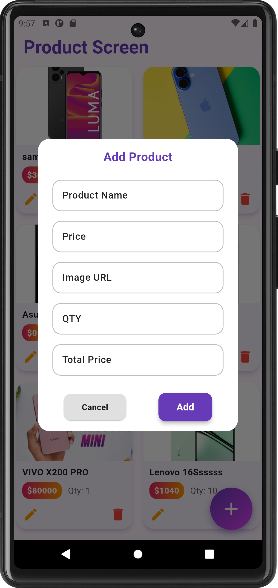

# API CRUD Flutter App

A **Flutter-based CRUD application** for managing products using a REST API. This app allows you to **Create, Read, Update, and Delete (CRUD)** products with a visually appealing UI, including **Hero animations, loading indicators, pull-to-refresh, and product details view**.

---
## 🛠 Features

### **Product Management**
- **Create Product:** Add a new product with name, image URL, price, quantity, total price.
- **Read Products:** Display all products in a **GridView** with **dynamic layout** for portrait and landscape.
- **Update Product:** Edit product details using a reusable **dialog form**.
- **Delete Product:** Remove a product with **confirmation dialog** and **SnackBar notifications**.

### **UI & UX**
- **Hero animation** for smooth image transition to product detail page.
- **Animated Loading:** Uses `LoadingAnimationWidget` during API calls.
- **Pull-to-Refresh:** Refresh products using `RefreshIndicator`.
- **Responsive Grid:** Grid layout changes **crossAxisCount** based on screen orientation.
- **Swipe/Interactive UI:** Edit/Delete buttons integrated into each product card.

### **Product Detail Page**
- Full details of selected product.
- Hero transition for image.
- Table of specifications (dummy data included: storage, battery, Bluetooth range, display resolution, processor, etc.)
- Scrollable layout for smaller screens.

### **Reusable Widgets**
- **TextFieldWidget:** Custom styled input fields for consistent design.
- **Reusable dialog** for both **Add** and **Update** product operations.

---

## 📦 Packages Used
- `http` → For API requests (GET, POST).  
- `loading_animation_widget` → For loading animations.  
- `flutter/material.dart` → Core Flutter widgets and UI.  

---

## 🔧 API Endpoints
Assuming a backend REST API:

| Operation       | Endpoint                       | Method  |
|-----------------|--------------------------------|---------|
| Create Product  | `/api/addProduct`              | POST    |
| Read Products   | `/api/readProducts`            | GET     |
| Update Product  | `/api/updateProduct/:id`       | POST    |
| Delete Product  | `/api/deleteProduct/:id`       | GET     |

---

## 🖥 Screenshots

<table>
  <tr>
   <td align="center">
       
      <b>Main Screen</b>
    </td>
    <td align="center">
       
      <b>Details</b>
    </td>
    <td align="center">
       
      <b>Dialog</b>
    </td>
  </tr>
</table>

- Product List (Grid View)
- Product Detail Page
- Add/Edit Product Dialog
- Loading Animation
---

## 🚀 Getting Started

### Prerequisites
- Flutter >= 3.0
- Dart >= 3.0
- API backend (Node.js, Django, or any REST API)

- [Lab: Write your first Flutter app](https://docs.flutter.dev/get-started/codelab)
- [Cookbook: Useful Flutter samples](https://docs.flutter.dev/cookbook)

For help getting started with Flutter development, view the
[online documentation](https://docs.flutter.dev/), which offers tutorials,
samples, guidance on mobile development, and a full API reference.
